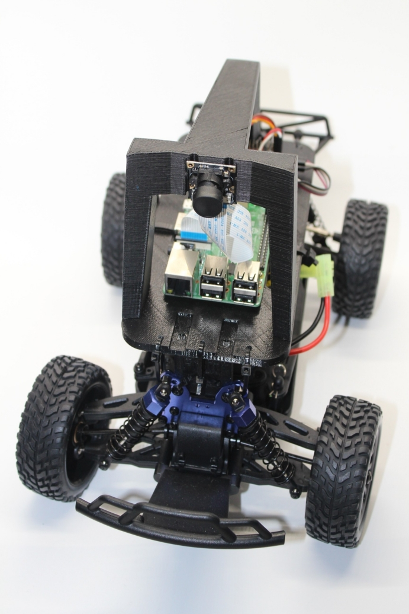

# Donkeycar Project

A collection of Donkeycar project.

My Donkeycar:



## Hardware Assembly

- Chassis: 1/16 2.4Ghz Exceed RC Racing Desert Short Cours RTR Truck AA
- Raspberry Pi 3b+
- Servo Shield
- 3D Printed Frame
- Pi Camera (A kind of Web Camera)
- Power Bank for Raspberry Pi

Reference: http://docs.donkeycar.com/guide/build_hardware

## Software Installation

### On Host PC

Follow doc: http://docs.donkeycar.com/guide/install_software/#step-1-install-software-on-host-pc.

Install miniconda Python 3.7 64 bit.

```
wget https://repo.anaconda.com/miniconda/Miniconda3-latest-Linux-x86_64.sh
bash ./Miniconda3-latest-Linux-x86_64.sh
```

Get the latest donkeycar from Github.

```
git clone https://github.com/autorope/donkeycar
cd donkeycar
git checkout master
```

If this is not your first install, update Conda and remove old donkey

```
conda update -n base -c defaults conda
conda env remove -n donkey
```

Create the Python anaconda environment

```
conda env create -f install/envs/ubuntu.yml
conda activate donkey
pip install -e .[pc]
```

Optionall Install Tensorflow GPU

You should have an NVidia GPU with the latest drivers. Conda will handle installing the correct cuda and cuddn libraries for the version of tensorflow you are using.

```
conda install tensorflow-gpu
```

Create your local working dir:

```
donkey createcar --path ~/mycar
```

### On Donkeycar (Raspberry Pi)

Follow doc: http://docs.donkeycar.com/guide/install_software/#step-2-install-software-on-donkeycar.

Change to a dir you would like to use as the head of your projects.

```
mkdir projects
cd projects
```

- Get the latest donkeycar from Github.

```
git clone https://github.com/autorope/donkeycar
cd donkeycar
git checkout master
pip install -e .[pi]
pip install tensorflow
```

You can validate your tensorflow install with

```
python -c "import tensorflow"
```

Warnings like this are normal:

```
/home/pi/env/lib/python3.5/importlib/_bootstrap.py:222: RuntimeWarning: compiletime version 3.4 of module 'tensorflow.python.framework.fast_tensor_util' does not match runtime version 3.5
  return f(*args, **kwds)
/home/pi/env/lib/python3.5/importlib/_bootstrap.py:222: RuntimeWarning: builtins.type size changed, may indicate binary incompatibility. Expected 432, got 412
  return f(*args, **kwds)
```

## Experiments

### 1. Web Browser Monitor and Controller

  Follow the doc: http://docs.donkeycar.com/guide/get_driving/.

### 2. F710 Teleoperation

  Source Code:

  https://github.com/xpharry/donkeypart_logitech_controller.git

  (Forked from: https://github.com/kevkruemp/donkeypart_logitech_controller.git)

  Run:

  ```
  python manage.py drive --js
  ```

### 3. Data collection


### 4. Training


### 5. Driving with the trained model
